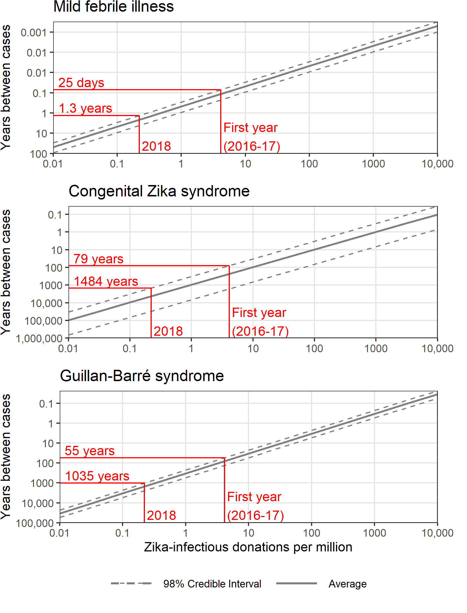
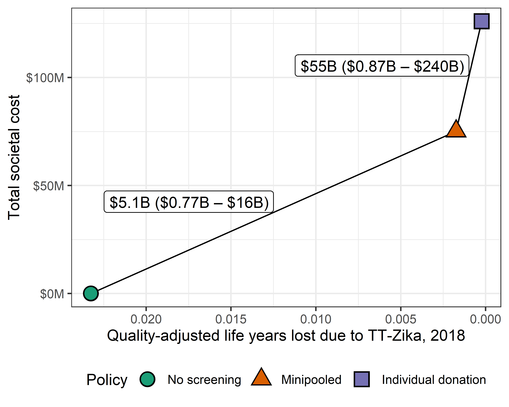

<br>

W. Alton Russell, MS^1,2^


<br>

^1^Department of Management Science and Engineering, Stanford University, Stanford, CA, USA

^2^Vitalant Research Institute, San Francisco, CA, USA


<br>

# Corresponding author

W. Alton Russell

475 Via Ortega

Stanford, CA 94305

altonr@stanford.edu

<br>

759 words

<br>

# Reproducible research statement

**Protocol:** Not available.

**Statistical code:** All code is available at doi.org/10.5281/zenodo.4068495.

**Data set:** The microsimulation uses a dataset on post-transfusion survival that is not public. All other data are available at doi.org/10.5281/zenodo.4068495.

#####

```{r setup, include = FALSE}
library(data.table)
library(ggplot2)
library(gridExtra)
library(cowplot)

theme_set(theme_bw())

#setwd("G:/My Drive/Blood Transfusion/Zika simulation/Threshold psa")

dt <- fread('G:/My Drive/Projects/Zika2020report/threshold_PSA_2020_combined.csv')
prev_levels <- exp(seq(log(1e-8), log(1e-2), length.out = 13))

dt.FLS <- melt(dt[ , paste0("flulike", 0:12)], measure.vars = paste0("flulike", 0:12))
dt.FLS[ , prev_num := as.numeric(substr(variable,8, nchar(as.character(variable))))]
dt.FLS[ , prevalence := prev_levels[prev_num+1]]

dt.CZS <- melt(dt[ , paste0("CZS", 0:12)], measure.vars = paste0("CZS", 0:12))
dt.CZS[ , prev_num := as.numeric(substr(variable,4, nchar(as.character(variable))))]
dt.CZS[ , prevalence := prev_levels[prev_num+1]]

dt.GBS <- melt(dt[ , paste0("GBS", 0:12)], measure.vars = paste0("GBS", 0:12))
dt.GBS[ , prev_num := as.numeric(substr(variable,4, nchar(as.character(variable))))]
dt.GBS[ , prevalence := prev_levels[prev_num+1]]

# dt[, totCost := costRecip0 + 
#      costInfant0 + costPartner0 + costPartnerInfant0 + costProductivity0]


# NS_cost_quants <- data.table(
#   cbind(
#     rbind(
#       dt[ , quantile(totCost_NS, probs = c(.005, .025, .1, .5, .9, .975, .995)) , by = Prevalence],
#       dt[ , mean(totCost_NS), by = Prevalence]),
#     c(
#       rep(c("lower_99", "lower_95", "lower_80", "Median", "upper_80", "upper_95", "upper_99"), 13),
#       rep("mean", 13))))
# colnames(NS_cost_quants) <- c("Prevalence", "Tot_cost", "Quantity")
# 
# NS_cost_quants <- dcast(NS_cost_quants, Prevalence ~ Quantity, value.var = "Tot_cost")
# 
# ggplot(NS_cost_quants, aes(x = Prevalence))  + 
#   geom_ribbon(aes(ymin = lower_99, ymax = upper_99), alpha = 0.3) + 
#   geom_ribbon(aes(ymin = lower_95, ymax = upper_95), alpha = 0.3) + 
#   geom_ribbon(aes(ymin = lower_80, ymax = upper_80), alpha = 0.3) + 
#   geom_line(aes(y = mean)) +
#   ylab("Total cost") +
#   scale_y_continuous(trans = "log10") +
#   scale_x_continuous(name = "ZIKV-infectious donations per million donations",
#                      trans = "log10",
#                      breaks = c(1e-8, 1e-7, 1e-6, 1e-5, 1e-4, 1e-3, 1e-2))
#   
#   

```

```{r CZS, include = FALSE}
dt.CZS_quants <- data.table(
  cbind(
    rbind(
      dt.CZS[ , quantile(value, probs = c(.01, .025, .1, .5, .9, .975, .99)) , by = prevalence],
      dt.CZS[ , mean(value), by = prevalence]),
    c(
      rep(c("lower_98", "lower_95", "lower_80", "Median", "upper_80", "upper_95", "upper_98"), 13),
      rep("mean", 13))))
colnames(dt.CZS_quants) <- c("Prevalence", "CZS", "Quantity")

dt.CZS_quants <- dcast(dt.CZS_quants, Prevalence ~ Quantity, value.var = "CZS")

CZS.coords_plt <- approx(x=dt.CZS_quants$Prevalence, y = dt.CZS_quants$upper_98, xout = c(56/13580225, 3/13580225))


plt_CZS <- ggplot(dt.CZS_quants, aes(x = Prevalence))  + 
  geom_line(aes(y = mean, linetype = "Average"), size = 0.8, color = "grey50") +
  geom_line(aes(y=lower_98, linetype = "98% Credible Interval"), color = "grey50")+
  geom_line(aes(y=upper_98, linetype = "98% Credible Interval"), color = "grey50")+
  #geom_line(aes(y=lower_95, linetype = "95% CrI"), color = "grey50")+
  #geom_line(aes(y=upper_95, linetype = "95% CrI"), color = "grey50")+
  #geom_line(aes(y=lower_80, linetype = "80% CrI"), color = "grey50")+
  #geom_line(aes(y=upper_80, linetype = "80% CrI"), color = "grey50")+
  #geom_hline(yintercept = 1, color = "red")+
  #annotate(geom = "text", x = 1.2e-8, y = 1, label = "Once-per-year risk", fontface = 'italic',  vjust=0, hjust=0)+
  #geom_hline(yintercept = .1, color = "red")+
  #annotate(geom = "text", x = 1.2e-8, y = .1, label = "Once-per-decade risk", fontface = 'italic', vjust=0, hjust=0)+
  #geom_vline(xintercept = 56/13580225, color="red")+
  #geom_vline(xintercept = 3/13580225, color="red")+
  #First year
  geom_segment(aes(x=1e-8, xend =  CZS.coords_plt$x[1], y = CZS.coords_plt$y[1], yend = CZS.coords_plt$y[1]), color="red")+
  geom_segment(aes(x=CZS.coords_plt$x[1], xend =  CZS.coords_plt$x[1], y = 1e-6, yend = CZS.coords_plt$y[1]), color="red")+
  annotate(geom = "text", x = 1.2e-8, y = CZS.coords_plt$y[1]*1.4, 
           label = paste0(round(CZS.coords_plt$y[1]^-1)," years"), color="red", vjust=0, hjust=0)+
  annotate(geom = "text", x = CZS.coords_plt$x[1]*1.1, y = 1e-6*1.4, 
           label = paste0("First year\n(2016-17)"), color="red", vjust=0, hjust=0)+
  #2018
  geom_segment(aes(x=1e-8, xend =  CZS.coords_plt$x[2], y = CZS.coords_plt$y[2], yend = CZS.coords_plt$y[2]), color="red")+
  geom_segment(aes(x=CZS.coords_plt$x[2], xend =  CZS.coords_plt$x[2], y = 1e-6, yend = CZS.coords_plt$y[2]), color="red")+
  annotate(geom = "text", x = 1.2e-8, y = CZS.coords_plt$y[2]*1.4, 
           label = paste0(round(CZS.coords_plt$y[2]^-1)," years"), color="red", vjust=0, hjust=0)+
  annotate(geom = "text", x = CZS.coords_plt$x[2]*1.1, y = 1e-6*1.4, 
           label = paste0("2018"), color="red", vjust=0, hjust=0)+
  scale_y_continuous(name = "Years between cases",
                     trans = "log10",
                     breaks = c(1e-6, 1e-5, 1e-4, 1e-3, 1e-2, 1e-1, 1, 1e1),
                     labels = c('1,000,000', '100,000', '10,000', '1000', '100', '10', '1', '0.1'),
                     expand = c(0,0)) +
  scale_x_continuous(name = "Zika-infectious donations per million",
                     trans = "log10",
                     breaks = c(1e-8, 1e-7, 1e-6, 1e-5, 1e-4, 1e-3, 1e-2),
                     labels = c('0.01', '0.1', '1', '10', '100', '1000', '10,000'),
                     expand = c(0,0)) +
  scale_fill_manual("legend", values = c("lightsteelblue1", "steelblue2", "midnightblue", "dodgerblue1"))+
  scale_linetype_manual("legend", values = c("dashed", "solid"))+
  theme(panel.grid.minor = element_blank(),
        panel.grid.major = element_line(colour = "gray90"),
        panel.background = element_rect(fill = "white"),
        axis.title = element_text(size=10),
        legend.position = "none",
        #legend.position = c(.8, .2)),
        legend.title = element_blank(),
        plot.margin = unit(c(t=0, r=0.2, b=0.2, l=0), "in"))

```

```{r GBS, include = FALSE}
dt.GBS_quants <- data.table(
  cbind(
    rbind(
      dt.GBS[ , quantile(value, probs = c(.01, .025, .1, .5, .9, .975, .99)) , by = prevalence],
      dt.GBS[ , mean(value), by = prevalence]),
    c(
      rep(c("lower_98", "lower_95", "lower_80", "Median", "upper_80", "upper_95", "upper_98"), 13),
      rep("mean", 13))))
colnames(dt.GBS_quants) <- c("Prevalence", "GBS", "Quantity")

dt.GBS_quants <- dcast(dt.GBS_quants, Prevalence ~ Quantity, value.var = "GBS")

GBS.coords_plt <- approx(x=dt.GBS_quants$Prevalence, y = dt.GBS_quants$upper_98, xout = c(56/13580225, 3/13580225))


plt_GBS <- ggplot(dt.GBS_quants, aes(x = Prevalence))  + 
  geom_line(aes(y = mean, linetype = "Average"), size = 0.8, color = "grey50") +
  geom_line(aes(y=lower_98, linetype = "98% CrI"), color = "grey50")+
  geom_line(aes(y=upper_98, linetype = "98% CrI"), color = "grey50")+
  #geom_line(aes(y=lower_95, linetype = "95% CrI"), color = "grey50")+
  #geom_line(aes(y=upper_95, linetype = "95% CrI"), color = "grey50")+
  #geom_line(aes(y=lower_80, linetype = "80% CrI"), color = "grey50")+
  #geom_line(aes(y=upper_80, linetype = "80% CrI"), color = "grey50")+
  #geom_hline(yintercept = 1, color = "red")+
  #annotate(geom = "text", x = 1.2e-8, y = 1, label = "Once-per-year risk", fontface = 'italic',  vjust=0, hjust=0)+
  #geom_hline(yintercept = .1, color = "red")+
  #annotate(geom = "text", x = 1.2e-8, y = .1, label = "Once-per-decade risk", fontface = 'italic', vjust=0, hjust=0)+
  #geom_vline(xintercept = 56/13580225, color="red")+
  #geom_vline(xintercept = 3/13580225, color="red")+
  #First year
  geom_segment(aes(x=1e-8, xend =  GBS.coords_plt$x[1], y = GBS.coords_plt$y[1], yend = GBS.coords_plt$y[1]), color="red")+
  geom_segment(aes(x=GBS.coords_plt$x[1], xend =  GBS.coords_plt$x[1], y = 1e-5, yend = GBS.coords_plt$y[1]), color="red")+
  annotate(geom = "text", x = 1.2e-8, y = GBS.coords_plt$y[1]*1.4, 
           label = paste0(round(GBS.coords_plt$y[1]^-1)," years"), color="red", vjust=0, hjust=0)+
  annotate(geom = "text", x = GBS.coords_plt$x[1]*1.1, y = 1e-5*1.4, 
           label = paste0("First year\n(2016-17)"), color="red", vjust=0, hjust=0)+
  #2018
  geom_segment(aes(x=1e-8, xend =  GBS.coords_plt$x[2], y = GBS.coords_plt$y[2], yend = GBS.coords_plt$y[2]), color="red")+
  geom_segment(aes(x=GBS.coords_plt$x[2], xend =  GBS.coords_plt$x[2], y = 1e-5, yend = GBS.coords_plt$y[2]), color="red")+
  annotate(geom = "text", x = 1.2e-8, y = GBS.coords_plt$y[2]*1.4, 
           label = paste0(round(GBS.coords_plt$y[2]^-1)," years"), color="red", vjust=0, hjust=0)+
  annotate(geom = "text", x = GBS.coords_plt$x[2]*1.1, y = 1e-5*1.4, 
           label = paste0("2018"), color="red", vjust=0, hjust=0)+
  scale_y_continuous(name = "Years between cases",
                     trans = "log10",
                     breaks = c(1e-5, 1e-4, 1e-3, 1e-2, 1e-1, 1, 1e1),
                     labels = c('100,000', '10,000', '1000', '100', '10', '1', '0.1'),
                     expand = c(0,0)) +
  scale_x_continuous(name = "Zika-infectious donations per million",
                     trans = "log10",
                     breaks = c(1e-8, 1e-7, 1e-6, 1e-5, 1e-4, 1e-3, 1e-2),
                     labels = c('0.01', '0.1', '1', '10', '100', '1000', '10,000'),
                     expand = c(0,0)) +
  scale_fill_manual("legend", values = c("lightsteelblue1", "steelblue2", "midnightblue", "dodgerblue1"))+
  scale_linetype_manual("legend", values = c("dashed", "solid"))+
  theme(panel.grid.minor = element_blank(),
        panel.grid.major = element_line(colour = "gray90"),
        panel.background = element_rect(fill = "white"),
        axis.title = element_text(size=10),
        legend.position = "none",
        legend.title = element_blank(),
        plot.margin = unit(c(t=0, r=0.2, b=0, l=0), "in"))

```

```{r FLS, include = FALSE}
dt.FLS_quants <- data.table(
  cbind(
    rbind(
      dt.FLS[ , quantile(value, probs = c(.01, .025, .1, .5, .9, .975, .99)) , by = prevalence],
      dt.FLS[ , mean(value), by = prevalence]),
    c(
      rep(c("lower_98", "lower_95", "lower_80", "Median", "upper_80", "upper_95", "upper_98"), 13),
      rep("mean", 13))))
colnames(dt.FLS_quants) <- c("Prevalence", "FLS", "Quantity")

dt.FLS_quants <- dcast(dt.FLS_quants, Prevalence ~ Quantity, value.var = "FLS")

FLS.coords_plt <- approx(x=dt.FLS_quants$Prevalence, y = dt.FLS_quants$upper_98, xout = c(56/13580225, 3/13580225))


plt_FLS <- ggplot(dt.FLS_quants, aes(x = Prevalence))  + 
  geom_line(aes(y = mean, linetype = "Average"), size = 0.8, color = "grey50") +
  geom_line(aes(y=lower_98, linetype = "98% CrI"), color = "grey50")+
  geom_line(aes(y=upper_98, linetype = "98% CrI"), color = "grey50")+
  #geom_line(aes(y=lower_95, linetype = "95% CrI"), color = "grey50")+
  #geom_line(aes(y=upper_95, linetype = "95% CrI"), color = "grey50")+
  #geom_line(aes(y=lower_80, linetype = "80% CrI"), color = "grey50")+
  #geom_line(aes(y=upper_80, linetype = "80% CrI"), color = "grey50")+
  #geom_hline(yintercept = 1, color = "red")+
  #annotate(geom = "text", x = 1.2e-8, y = 1, label = "Once-per-year risk", fontface = 'italic',  vjust=0, hjust=0)+
  #geom_hline(yintercept = .1, color = "red")+
  #annotate(geom = "text", x = 1.2e-8, y = .1, label = "Once-per-decade risk", fontface = 'italic', vjust=0, hjust=0)+
  #geom_vline(xintercept = 56/13580225, color="red")+
  #geom_vline(xintercept = 3/13580225, color="red")+
  #First year
  geom_segment(aes(x=1e-8, xend =  FLS.coords_plt$x[1], y = FLS.coords_plt$y[1], yend = FLS.coords_plt$y[1]), color="red")+
  geom_segment(aes(x=FLS.coords_plt$x[1], xend =  FLS.coords_plt$x[1], y = 1e-2, yend = FLS.coords_plt$y[1]), color="red")+
  annotate(geom = "text", x = 1.2e-8, y = FLS.coords_plt$y[1]*1.4, 
           label = paste0(round(FLS.coords_plt$y[1]^-1*365.25, 0)," days"), color="red", vjust=0, hjust=0)+
  annotate(geom = "text", x = FLS.coords_plt$x[1]*1.1, y = 1e-2*1.4, 
           label = paste0("First year\n(2016-17)"), color="red", vjust=0, hjust=0)+
  #2018
  geom_segment(aes(x=1e-8, xend =  FLS.coords_plt$x[2], y = FLS.coords_plt$y[2], yend = FLS.coords_plt$y[2]), color="red")+
  geom_segment(aes(x=FLS.coords_plt$x[2], xend =  FLS.coords_plt$x[2], y = 1e-2, yend = FLS.coords_plt$y[2]), color="red")+
  annotate(geom = "text", x = 1.2e-8, y = FLS.coords_plt$y[2]*1.4, 
           label = paste0(round(FLS.coords_plt$y[2]^-1, 1)," years"), color="red", vjust=0, hjust=0)+
  annotate(geom = "text", x = FLS.coords_plt$x[2]*1.1, y = 1e-2*1.4, 
           label = paste0("2018"), color="red", vjust=0, hjust=0)+
  scale_y_continuous(name = "Years between cases",
                     trans = "log10",
                     breaks = c(1e-2, 1e-1, 1, 1e1, 1e2, 1e3, 1e4),
                     labels = c('     100', '10', '1', '0.1', '0.01', '0.01', '0.001'),
                     expand = c(0,0)) +
  scale_x_continuous(name = "Zika-infectious donations per million",
                     trans = "log10",
                     breaks = c(1e-8, 1e-7, 1e-6, 1e-5, 1e-4, 1e-3, 1e-2),
                     labels = c('0.01', '0.1', '1', '10', '100', '1000', '10,000'),
                     expand = c(0,0)) +
  scale_fill_manual("legend", values = c("lightsteelblue1", "steelblue2", "midnightblue", "dodgerblue1"))+
  scale_linetype_manual("legend", values = c("dashed", "solid"))+
  theme(panel.grid.minor = element_blank(),
        panel.grid.major = element_line(colour = "gray90"),
        panel.background = element_rect(fill = "white"),
        #plot.margin = margin(0,25,0,0),
        legend.position = "none",
        axis.title = element_text(size=10),
        #legend.position = c(.8, .2)),
        legend.title = element_blank(),
        plot.margin = unit(c(t=0, r=0.2, b=0.2, l=0), "in"))


FLS.approx_mean <- approx(x=dt.FLS_quants$Prevalence, y = dt.FLS_quants$mean, xout = c(56/13580225, 3/13580225))
FLS.approx_upper <- approx(x=dt.FLS_quants$Prevalence, y = dt.FLS_quants$upper_98, xout = c(56/13580225, 3/13580225))
FLS.approx_lower <- approx(x=dt.FLS_quants$Prevalence, y = dt.FLS_quants$lower_98, xout = c(56/13580225, 3/13580225))

```

```{r ICER, include = FALSE}
dt_ICER <- fread('G:/My Drive/Projects/Zika2020report/threshold_PSA_ICER_combined.csv')

#Add total cost columns
dt_ICER[, totCost0 := costBC0 + costRecip0 + 
       costInfant0 + costPartner0 + costPartnerInfant0 + costProductivity0]
dt_ICER[, totCost1 := costBC1 + costRecip1 + 
       costInfant1 + costPartner1 + costPartnerInfant1 + costProductivity1]
dt_ICER[, totCost2 := costBC2 + costRecip2 + 
       costInfant2 + costPartner2 + costPartnerInfant2 + costProductivity2]


#Add total QALY loss columns
dt_ICER[, totQALYL0 := QALYLrecip0 + QALYLinfant0 + QALYLpartner0 + QALYLpartnerInfant0]
dt_ICER[, totQALYL1 := QALYLrecip1 + QALYLinfant1 + QALYLpartner1 + QALYLpartnerInfant1]
dt_ICER[, totQALYL2 := QALYLrecip2 + QALYLinfant2 + QALYLpartner2 + QALYLpartnerInfant2]

ICER_mp_mean <- dt_ICER[, mean((totCost2 - totCost0)/(totQALYL0 - totQALYL2))]
ICER_mp_90CrI <- dt_ICER[, quantile((totCost2 - totCost0)/(totQALYL0 - totQALYL2), probs = c(0.01, 0.99))]
ICER_id_mean <- dt_ICER[, mean((totCost1 - totCost2)/(totQALYL2 - totQALYL1))]
ICER_id_90CrI <- dt_ICER[, quantile((totCost1 - totCost2)/(totQALYL2 - totQALYL1), probs = c(0.01, 0.99))]

```
# Key words

Blood safety, transfusion-transmitted infection, hemovigilance, Zika virus, decision-analytic modeling

<br> 


# Declarations

**Funding:** WAR was funded by a Stanford Interdisciplinary Graduate Fellowship.

**Conflicts:** WAR has provided unrelated consulting services to Terumo BCT.

**Ethics/Consent:** No primary human subjects data were involved in this analysis.

**Authors’ contributions:** WAR conducted the analysis and wrote the manuscript.

**Acknowledgements:** The author thanks Dr. Brian Custer from Vitalant Research Institute and UCSF for his review of the manuscript and suggested revisions.

#####

# Background

> Most Zika infections are asymptomatic, but about 20% of infected persons develop mild febrile illness. Rarely, Zika can cause two serious complications: Guillain-Barré syndrome and congenital Zika syndrome, a pattern of devastating birth defects [@Longo2019]. The U.S. Food and Drug Administration (FDA) mandated universal screening of donated blood for Zika virus in 2016 and allowed minipooled testing beginning in 2018 [@FDAGuidance2018]. A simulation study published January 2019 estimated that serious complications due to transfusion-transmitted Zika (TT-Zika) were unlikely and that universal screening for Zika was not cost-effective during the first year of screening in the 50 states [@Russell2019]. That analysis used a willingness-to-pay threshold of $1 million per quality-adjusted life year (QALY), reflecting a willingness to spend more per QALY for transfusion safety than is considered cost-effective elsewhere in medicine. Two months later, the Blood Products Advisory Committee (BPAC) recommended continuing universal screening, citing uncertainty in the risk of serious complications, and the committee agreed to reassess one year later [@BPAC2019]. The April 2020 BPAC meeting has been indefinitely postponed due to the current COVID-19 pandemic. Universal screening costs blood centers in the 50 states \$8 -- \$13 million each month [@Russell2019] and yielded 3 presumed viremic donations in 2018 and zero in 2019-20 as of December 3, 2020 [@CDC_ZIKV2020].

# Objective

> To estimate (1) the relationship between the rate of Zika-infectious donations and the rate of adverse outcomes due to TT-Zika in the 50 states without screening and (2) the 2018 cost-effectiveness of universal screening.


# Methods and Findings

> The simulation from the 2019 analysis was run at 13 Zika-infectious donation rates between 0.01 and 10,000 per million donations. Parameters were resampled 10,000 times from distributions reflecting uncertainty [@Russell2019]. Rates of mild febrile illness, congenital Zika syndrome, and Guillain-Barré syndrome cases in transfusion recipients and their sexual partners were calculated. **Figure 1** was generated by linearly interpolating between the mean, 1st percentile, and 99th percentile of outcomes at the 13 Zika-infectious donation rates. Outcomes were reported at the Zika-infectious donation rates from 2018 (3 in 13.56 million donations) [@CDC_ZIKV2020] and from the first year of screening (56 in 13.56 million donations) [@Russell2019], defined as May 23, 2016 -- November 4, 2017 to account for staggered screening implementation. To avoid underestimating risk, all viremic donations were treated as infectious despite 42 of 56 viremic donations (81%) from the first year of screening having IgM antibodies that likely precluded transfusion-transmission [@Russell2019]. Code and most data are public [@Zenodo2020].

> Without screening, mild febrile illness caused by TT-Zika would have occurred at an estimated rate of one case every `r round(FLS.approx_mean$y[1]^(-1)*12, 1)` months (98% Credible Interval [CrI] every `r round(FLS.approx_upper$y[1]^(-1)*12, 1)` -- `r round(FLS.approx_lower$y[1]^(-1)*12, 1)` months) during the first year (2016-17). In 99% of simulations, the estimated rate of mild febrile illness in 2018 without screening was below one case every 1.3 years. 

> Serious TT-Zika complications were unlikely. For the rate of congenital Zika syndrome to exceed one case per decade, the rate of Zika-infectious donations needed to exceed `r round(approx(y=dt.CZS_quants$Prevalence, x = dt.CZS_quants$mean, xout = 1/10)$y*1e6, digits = 0)` per million (98% CrI `r round(approx(y=dt.CZS_quants$Prevalence, x = dt.CZS_quants$upper_98, xout = 1/10)$y*1e6, digits = 0)` -- `r round(approx(y=dt.CZS_quants$Prevalence, x = dt.CZS_quants$lower_98, xout = 1/10)$y*1e6, digits = 0)` per million), `r round(approx(y=dt.CZS_quants$Prevalence, x = dt.CZS_quants$mean, xout = 1/10)$y / (56/13580225), digits = 0)` times larger than the rate observed in the first year of screening. For the rate of Guillain-Barré syndrome to exceed one case per decade, the rate of Zika-infectious donations needed to exceed `r round(approx(y=dt.GBS_quants$Prevalence, x = dt.GBS_quants$mean, xout = 1/10)$y*1e6, digits = 0)` per million (98% CrI `r round(approx(y=dt.GBS_quants$Prevalence, x = dt.GBS_quants$upper_98, xout = 1/10)$y*1e6, digits = 0)` -- `r round(approx(y=dt.GBS_quants$Prevalence, x = dt.GBS_quants$lower_98, xout = 1/10)$y*1e6, digits = 0)` per million), `r round(approx(y=dt.GBS_quants$Prevalence, x = dt.GBS_quants$mean, xout = 1/10)$y / (56/13580225), digits = 0)` times larger than the rate observed in the first year of screening. In 99% of simulations, the estimated rate of congenital Zika syndrome cases was below one case every 1483 years at the 2018 Zika-infectious donation rate, and the rate of Guillain-Barré syndrome cases was below one case every 1035 years. In 2018, universal minipooled testing cost $`r signif(ICER_mp_mean/1e9, 2)` billion per quality-adjusted life year gained compared to no screening (98% CrI $`r signif(ICER_mp_90CrI[1]/1e9, 2)` -- `r signif(ICER_mp_90CrI[2]/1e9, 2)` billion; **Figure 2**).

# Discussion

> A much larger outbreak than has been observed in the 50 states to date would be required for the rate of serious TT-Zika complications to exceed one case per decade. While Zika resurgence is possible, low endemic levels of Zika and established herd immunity in many regions make a larger outbreak unlikely. Any resurgences could be monitored using clinical case reports and forecasting models developed during the 2016-17 pandemic [@Kobres2019], guiding decision around targeted donation screening or travel-based donor deferral policies. 

> To date, decision-analytic modeling has played a limited role in informing American blood safety policy. Reports often emphasize cost-effectiveness but include estimation of risk and other policy-relevant outcomes. This report demonstrates that model-based analyses can be tailored to policymakers’ concerns (i.e., risk of serious adverse events). Enhanced collaboration could improve understanding between policymakers and modelers, increasing the policy relevance and utilization of model-based reports.


#####

```{r fig1, include = FALSE}

plt_legend <- get_legend(plt_CZS+
                           theme(legend.position = "bottom",
                                 legend.key.width = unit(0.6, "in")))


g <- grid.arrange(plt_FLS+ggtitle("Mild febrile illness"),
                  plt_CZS+ggtitle("Congenital Zika syndrome"),
             plt_GBS+ggtitle("Guillan-Barré syndrome"),
             plt_legend,
             ncol = 1,
             heights = c(2.5, 2.5, 2.3, 0.4))


ggsave(
  file = "fig1.jpeg",
  g,
  height = 7.7,
  width = 5.5,
  units = "in",
  dpi = 700
)

ggsave(
  file = "fig1.png",
  g,
  height = 7.7,
  width = 5.5,
  units = "in",
  dpi = 700
)

ggsave(
  file = "fig1.pdf",
  g,
  height = 7.7,
  width = 5.5,
  units = "in",
  dpi = 700
)

```

**Figure 1** The expected rate of transfusion-transmitted Zika adverse outcomes based on the rate of Zika-infectious donations. In red, two example Zika-infectious donation rates are indicated with the corresponding 99th percentile estimates of the rate of adverse outcomes.



#####

```{r fig2, include = FALSE}

dt_ICER_plt <- data.table(rbind(
  cbind(
    Policy = "No screening",
    QALYL = -1*dt_ICER$totQALYL0,
    Cost = dt_ICER$totCost0
  ),
  cbind(
    Policy = "Individual donation",
    QALYL = -1*dt_ICER$totQALYL1,
    Cost = dt_ICER$totCost1
  ),
  cbind(
    Policy = "Minipooled",
    QALYL = -1*dt_ICER$totQALYL2,
    Cost = dt_ICER$totCost2
  )
))
dt_ICER_plt[ , Cost := as.numeric(Cost)]
dt_ICER_plt[ , QALYL := as.numeric(QALYL)]

dt_ICER_plt[ , Policy := factor(Policy, levels = c("No screening", "Minipooled", "Individual donation"))]
dt_ICER_mean <- dt_ICER_plt[ , list("Cost" = mean(Cost), "QALYL" = mean(QALYL)), by=Policy]

mp_lab <- paste0("$",signif(ICER_mp_mean/1e9,2), "B ($", signif(ICER_mp_90CrI[1]/1e9,2), "B – $", signif(ICER_mp_90CrI[2]/1e9,2),"B)")
mp_lab_x <- dt_ICER_mean[Policy!="Individual donation", mean(QALYL)]
mp_lab_y <- dt_ICER_mean[Policy!="Individual donation", mean(Cost)]

id_lab <- paste0("$",signif(ICER_id_mean/1e9,2), "B ($", signif(ICER_id_90CrI[1]/1e9,2), "B – $", signif(ICER_id_90CrI[2]/1e9,2),"B)")
id_lab_x <- dt_ICER_mean[Policy!="No screening", mean(QALYL)]
id_lab_y <- dt_ICER_mean[Policy!="No screening", mean(Cost)]

plt_frontier <- ggplot()+
  # geom_point(data = dt_ICER_plt,
  #             aes(x = QALYL, y = Cost, color = Policy, shape = Policy), alpha = 0.05)+
  geom_line(data = dt_ICER_mean,
            aes(x = QALYL, y = Cost))+
  geom_point(data = dt_ICER_mean,
             aes(x = QALYL, y = Cost, shape = Policy), size=5, color = "black")+
  geom_point(data = dt_ICER_mean,
             aes(x = QALYL, y = Cost, color = Policy, shape = Policy), size=4)+
  
  xlab("Quality-adjusted life years lost due to TT-Zika, 2018")+
  ylab("Total societal cost")+
  scale_y_continuous(labels = function(x){paste0("$",signif(x/1e6),"M")})+
  scale_x_continuous(labels = function(x){sprintf("%.3f", round(abs(x),3))})+
  theme(legend.position = "bottom")+
  geom_label(aes(x=mp_lab_x, y=mp_lab_y, label=mp_lab),vjust=0, hjust=1)+
  geom_label(aes(x=id_lab_x, y=id_lab_y, label=id_lab),vjust=0, hjust=1)+
  scale_color_manual(values = c("#1b9e77", "#d95f02", "#7570b3"))
  # scale_shape_manual(values = c(15,16,17),
  #                    labels = c("No screening", "Minipooled screening", "Individual donation screening"))+
  # scale_color_manual(values = c("#1b9e77", "#d95f02", "#7570b3"),
  #                  labels = c("No screening", "Minipooled screening", "Individual donation screening"))
  
ggsave("fig2.jpeg",
       height = 4,
       width = 5,
       units = "in",
       dpi = 700)

ggsave("fig2.png",
       height = 4,
       width = 5,
       units = "in",
       dpi = 700)

ggsave("fig2.pdf",
       height = 4,
       width = 5,
       units = "in")
  
```
**Figure 2** Incremental cost-effectiveness ratio (ICER) in cost per quality-adjusted life years gained of minipooled screening compared to no screening and of individual donation screening compared to minipooled screening based on the 2018 rate of Zika-infectious donations. The average cost and effectiveness of 10,000 simulations are plotted. Connecting ICER lines are labeled with the average and 98% credible interval ICER estimates.




#####

# References

<div id="refs"></div>
