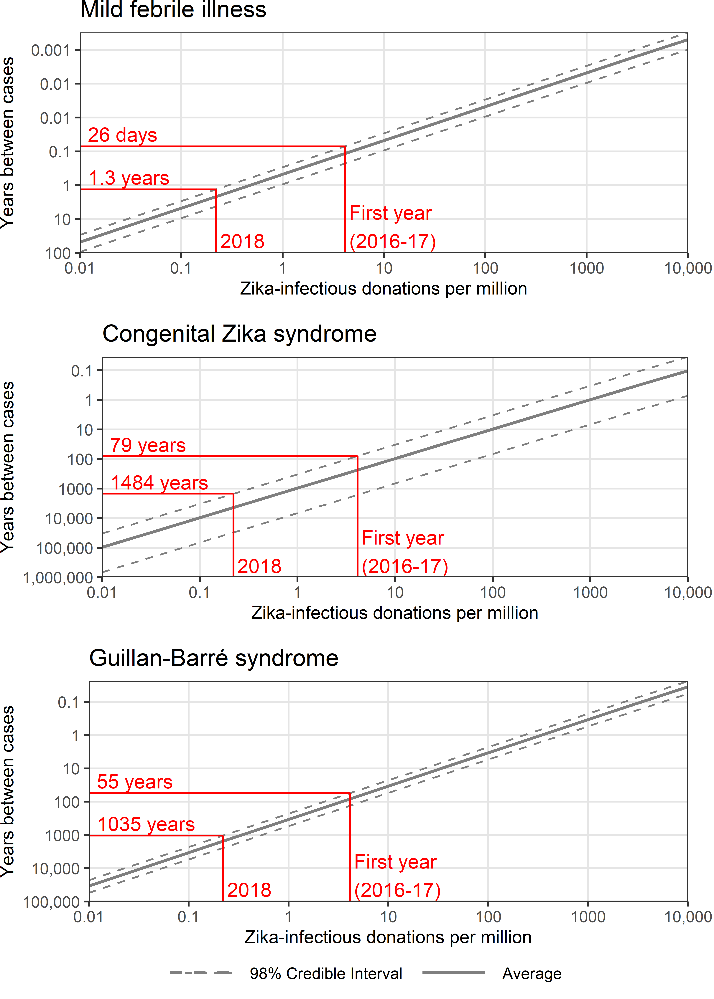

<br>

W. Alton Russell, MS^1,2^


<br>

^1^Department of Management Science and Engineering, Stanford University, Stanford, CA, USA

^2^Vitalant Research Institute, San Francisco, CA, USA


<br>

# Corresponding author

W. Alton Russell

475 Via Ortega

Stanford, CA 94305

altonr@stanford.edu

<br>
700 words

#####

```{r setup, include = FALSE}
library(data.table)
library(ggplot2)
library(gridExtra)

theme_set(theme_bw())

#setwd("G:/My Drive/Blood Transfusion/Zika simulation/Threshold psa")

dt <- fread('G:/My Drive/Blood Transfusion/Zika/Zika2020report/threshold_PSA_2020_combined.csv')
prev_levels <- exp(seq(log(1e-8), log(1e-2), length.out = 13))

dt.FLS <- melt(dt[ , paste0("flulike", 0:12)], measure.vars = paste0("flulike", 0:12))
dt.FLS[ , prev_num := as.numeric(substr(variable,8, nchar(as.character(variable))))]
dt.FLS[ , prevalence := prev_levels[prev_num+1]]

dt.CZS <- melt(dt[ , paste0("CZS", 0:12)], measure.vars = paste0("CZS", 0:12))
dt.CZS[ , prev_num := as.numeric(substr(variable,4, nchar(as.character(variable))))]
dt.CZS[ , prevalence := prev_levels[prev_num+1]]

dt.GBS <- melt(dt[ , paste0("GBS", 0:12)], measure.vars = paste0("GBS", 0:12))
dt.GBS[ , prev_num := as.numeric(substr(variable,4, nchar(as.character(variable))))]
dt.GBS[ , prevalence := prev_levels[prev_num+1]]

# dt[, totCost := costRecip0 + 
#      costInfant0 + costPartner0 + costPartnerInfant0 + costProductivity0]


# NS_cost_quants <- data.table(
#   cbind(
#     rbind(
#       dt[ , quantile(totCost_NS, probs = c(.005, .025, .1, .5, .9, .975, .995)) , by = Prevalence],
#       dt[ , mean(totCost_NS), by = Prevalence]),
#     c(
#       rep(c("lower_99", "lower_95", "lower_80", "Median", "upper_80", "upper_95", "upper_99"), 13),
#       rep("mean", 13))))
# colnames(NS_cost_quants) <- c("Prevalence", "Tot_cost", "Quantity")
# 
# NS_cost_quants <- dcast(NS_cost_quants, Prevalence ~ Quantity, value.var = "Tot_cost")
# 
# ggplot(NS_cost_quants, aes(x = Prevalence))  + 
#   geom_ribbon(aes(ymin = lower_99, ymax = upper_99), alpha = 0.3) + 
#   geom_ribbon(aes(ymin = lower_95, ymax = upper_95), alpha = 0.3) + 
#   geom_ribbon(aes(ymin = lower_80, ymax = upper_80), alpha = 0.3) + 
#   geom_line(aes(y = mean)) +
#   ylab("Total cost") +
#   scale_y_continuous(trans = "log10") +
#   scale_x_continuous(name = "ZIKV-infectious donations per million donations",
#                      trans = "log10",
#                      breaks = c(1e-8, 1e-7, 1e-6, 1e-5, 1e-4, 1e-3, 1e-2))
#   
#   

```

```{r CZS, include = FALSE}
dt.CZS_quants <- data.table(
  cbind(
    rbind(
      dt.CZS[ , quantile(value, probs = c(.01, .025, .1, .5, .9, .975, .99)) , by = prevalence],
      dt.CZS[ , mean(value), by = prevalence]),
    c(
      rep(c("lower_98", "lower_95", "lower_80", "Median", "upper_80", "upper_95", "upper_98"), 13),
      rep("mean", 13))))
colnames(dt.CZS_quants) <- c("Prevalence", "CZS", "Quantity")

dt.CZS_quants <- dcast(dt.CZS_quants, Prevalence ~ Quantity, value.var = "CZS")

CZS.coords_plt <- approx(x=dt.CZS_quants$Prevalence, y = dt.CZS_quants$upper_98, xout = c(56/13580225, 3/13580225))


plt_CZS <- ggplot(dt.CZS_quants, aes(x = Prevalence))  + 
  geom_line(aes(y = mean, linetype = "Average"), size = 0.8, color = "grey50") +
  geom_line(aes(y=lower_98, linetype = "98% Credible Interval"), color = "grey50")+
  geom_line(aes(y=upper_98, linetype = "98% Credible Interval"), color = "grey50")+
  #geom_line(aes(y=lower_95, linetype = "95% CrI"), color = "grey50")+
  #geom_line(aes(y=upper_95, linetype = "95% CrI"), color = "grey50")+
  #geom_line(aes(y=lower_80, linetype = "80% CrI"), color = "grey50")+
  #geom_line(aes(y=upper_80, linetype = "80% CrI"), color = "grey50")+
  #geom_hline(yintercept = 1, color = "red")+
  #annotate(geom = "text", x = 1.2e-8, y = 1, label = "Once-per-year risk", fontface = 'italic',  vjust=0, hjust=0)+
  #geom_hline(yintercept = .1, color = "red")+
  #annotate(geom = "text", x = 1.2e-8, y = .1, label = "Once-per-decade risk", fontface = 'italic', vjust=0, hjust=0)+
  #geom_vline(xintercept = 56/13580225, color="red")+
  #geom_vline(xintercept = 3/13580225, color="red")+
  #First year
  geom_segment(aes(x=1e-8, xend =  CZS.coords_plt$x[1], y = CZS.coords_plt$y[1], yend = CZS.coords_plt$y[1]), color="red")+
  geom_segment(aes(x=CZS.coords_plt$x[1], xend =  CZS.coords_plt$x[1], y = 1e-6, yend = CZS.coords_plt$y[1]), color="red")+
  annotate(geom = "text", x = 1.2e-8, y = CZS.coords_plt$y[1]*1.4, 
           label = paste0(round(CZS.coords_plt$y[1]^-1)," years"), color="red", vjust=0, hjust=0)+
  annotate(geom = "text", x = CZS.coords_plt$x[1]*1.1, y = 1e-6*1.4, 
           label = paste0("First year\n(2016-17)"), color="red", vjust=0, hjust=0)+
  #2018
  geom_segment(aes(x=1e-8, xend =  CZS.coords_plt$x[2], y = CZS.coords_plt$y[2], yend = CZS.coords_plt$y[2]), color="red")+
  geom_segment(aes(x=CZS.coords_plt$x[2], xend =  CZS.coords_plt$x[2], y = 1e-6, yend = CZS.coords_plt$y[2]), color="red")+
  annotate(geom = "text", x = 1.2e-8, y = CZS.coords_plt$y[2]*1.4, 
           label = paste0(round(CZS.coords_plt$y[2]^-1)," years"), color="red", vjust=0, hjust=0)+
  annotate(geom = "text", x = CZS.coords_plt$x[2]*1.1, y = 1e-6*1.4, 
           label = paste0("2018"), color="red", vjust=0, hjust=0)+
  scale_y_continuous(name = "Years between cases",
                     trans = "log10",
                     breaks = c(1e-6, 1e-5, 1e-4, 1e-3, 1e-2, 1e-1, 1, 1e1),
                     labels = c('1,000,000', '100,000', '10,000', '1000', '100', '10', '1', '0.1'),
                     expand = c(0,0)) +
  scale_x_continuous(name = "",
                     trans = "log10",
                     breaks = c(1e-8, 1e-7, 1e-6, 1e-5, 1e-4, 1e-3, 1e-2),
                     labels = c('0.01', '0.1', '1', '10', '100', '1000', '10,000'),
                     expand = c(0,0)) +
  scale_fill_manual("legend", values = c("lightsteelblue1", "steelblue2", "midnightblue", "dodgerblue1"))+
  scale_linetype_manual("legend", values = c("dashed", "solid"))+
  theme(panel.grid.minor = element_blank(),
        panel.grid.major = element_line(colour = "gray90"),
        panel.background = element_rect(fill = "white"),
        plot.margin = margin(0,25,0,0),
        legend.position = "none",
        #legend.position = c(.8, .2)),
        legend.title = element_blank())

```


```{r GBS, include = FALSE}
dt.GBS_quants <- data.table(
  cbind(
    rbind(
      dt.GBS[ , quantile(value, probs = c(.01, .025, .1, .5, .9, .975, .99)) , by = prevalence],
      dt.GBS[ , mean(value), by = prevalence]),
    c(
      rep(c("lower_98", "lower_95", "lower_80", "Median", "upper_80", "upper_95", "upper_98"), 13),
      rep("mean", 13))))
colnames(dt.GBS_quants) <- c("Prevalence", "GBS", "Quantity")

dt.GBS_quants <- dcast(dt.GBS_quants, Prevalence ~ Quantity, value.var = "GBS")

GBS.coords_plt <- approx(x=dt.GBS_quants$Prevalence, y = dt.GBS_quants$upper_98, xout = c(56/13580225, 3/13580225))


plt_GBS <- ggplot(dt.GBS_quants, aes(x = Prevalence))  + 
  geom_line(aes(y = mean, linetype = "Average"), size = 0.8, color = "grey50") +
  geom_line(aes(y=lower_98, linetype = "98% CrI"), color = "grey50")+
  geom_line(aes(y=upper_98, linetype = "98% CrI"), color = "grey50")+
  #geom_line(aes(y=lower_95, linetype = "95% CrI"), color = "grey50")+
  #geom_line(aes(y=upper_95, linetype = "95% CrI"), color = "grey50")+
  #geom_line(aes(y=lower_80, linetype = "80% CrI"), color = "grey50")+
  #geom_line(aes(y=upper_80, linetype = "80% CrI"), color = "grey50")+
  #geom_hline(yintercept = 1, color = "red")+
  #annotate(geom = "text", x = 1.2e-8, y = 1, label = "Once-per-year risk", fontface = 'italic',  vjust=0, hjust=0)+
  #geom_hline(yintercept = .1, color = "red")+
  #annotate(geom = "text", x = 1.2e-8, y = .1, label = "Once-per-decade risk", fontface = 'italic', vjust=0, hjust=0)+
  #geom_vline(xintercept = 56/13580225, color="red")+
  #geom_vline(xintercept = 3/13580225, color="red")+
  #First year
  geom_segment(aes(x=1e-8, xend =  GBS.coords_plt$x[1], y = GBS.coords_plt$y[1], yend = GBS.coords_plt$y[1]), color="red")+
  geom_segment(aes(x=GBS.coords_plt$x[1], xend =  GBS.coords_plt$x[1], y = 1e-5, yend = GBS.coords_plt$y[1]), color="red")+
  annotate(geom = "text", x = 1.2e-8, y = GBS.coords_plt$y[1]*1.4, 
           label = paste0(round(GBS.coords_plt$y[1]^-1)," years"), color="red", vjust=0, hjust=0)+
  annotate(geom = "text", x = GBS.coords_plt$x[1]*1.1, y = 1e-5*1.4, 
           label = paste0("First year\n(2016-17)"), color="red", vjust=0, hjust=0)+
  #2018
  geom_segment(aes(x=1e-8, xend =  GBS.coords_plt$x[2], y = GBS.coords_plt$y[2], yend = GBS.coords_plt$y[2]), color="red")+
  geom_segment(aes(x=GBS.coords_plt$x[2], xend =  GBS.coords_plt$x[2], y = 1e-5, yend = GBS.coords_plt$y[2]), color="red")+
  annotate(geom = "text", x = 1.2e-8, y = GBS.coords_plt$y[2]*1.4, 
           label = paste0(round(GBS.coords_plt$y[2]^-1)," years"), color="red", vjust=0, hjust=0)+
  annotate(geom = "text", x = GBS.coords_plt$x[2]*1.1, y = 1e-5*1.4, 
           label = paste0("2018"), color="red", vjust=0, hjust=0)+
  scale_y_continuous(name = "Years between cases",
                     trans = "log10",
                     breaks = c(1e-5, 1e-4, 1e-3, 1e-2, 1e-1, 1, 1e1),
                     labels = c('100,000', '10,000', '1000', '100', '10', '1', '0.1'),
                     expand = c(0,0)) +
  scale_x_continuous(name = "Zika-infectious donations per million",
                     trans = "log10",
                     breaks = c(1e-8, 1e-7, 1e-6, 1e-5, 1e-4, 1e-3, 1e-2),
                     labels = c('0.01', '0.1', '1', '10', '100', '1000', '10,000'),
                     expand = c(0,0)) +
  scale_fill_manual("legend", values = c("lightsteelblue1", "steelblue2", "midnightblue", "dodgerblue1"))+
  scale_linetype_manual("legend", values = c("dashed", "solid"))+
  theme(panel.grid.minor = element_blank(),
        panel.grid.major = element_line(colour = "gray90"),
        panel.background = element_rect(fill = "white"),
        plot.margin = margin(0,25,0,0),
        legend.position = "none",
        #legend.position = c(.8, .2)),
        legend.title = element_blank())

```


```{r FLS, include = FALSE}
dt.FLS_quants <- data.table(
  cbind(
    rbind(
      dt.FLS[ , quantile(value, probs = c(.01, .025, .1, .5, .9, .975, .99)) , by = prevalence],
      dt.FLS[ , mean(value), by = prevalence]),
    c(
      rep(c("lower_98", "lower_95", "lower_80", "Median", "upper_80", "upper_95", "upper_98"), 13),
      rep("mean", 13))))
colnames(dt.FLS_quants) <- c("Prevalence", "FLS", "Quantity")

dt.FLS_quants <- dcast(dt.FLS_quants, Prevalence ~ Quantity, value.var = "FLS")

FLS.coords_plt <- approx(x=dt.FLS_quants$Prevalence, y = dt.FLS_quants$upper_98, xout = c(56/13580225, 3/13580225))


plt_FLS <- ggplot(dt.FLS_quants, aes(x = Prevalence))  + 
  geom_line(aes(y = mean, linetype = "Average"), size = 0.8, color = "grey50") +
  geom_line(aes(y=lower_98, linetype = "98% CrI"), color = "grey50")+
  geom_line(aes(y=upper_98, linetype = "98% CrI"), color = "grey50")+
  #geom_line(aes(y=lower_95, linetype = "95% CrI"), color = "grey50")+
  #geom_line(aes(y=upper_95, linetype = "95% CrI"), color = "grey50")+
  #geom_line(aes(y=lower_80, linetype = "80% CrI"), color = "grey50")+
  #geom_line(aes(y=upper_80, linetype = "80% CrI"), color = "grey50")+
  #geom_hline(yintercept = 1, color = "red")+
  #annotate(geom = "text", x = 1.2e-8, y = 1, label = "Once-per-year risk", fontface = 'italic',  vjust=0, hjust=0)+
  #geom_hline(yintercept = .1, color = "red")+
  #annotate(geom = "text", x = 1.2e-8, y = .1, label = "Once-per-decade risk", fontface = 'italic', vjust=0, hjust=0)+
  #geom_vline(xintercept = 56/13580225, color="red")+
  #geom_vline(xintercept = 3/13580225, color="red")+
  #First year
  geom_segment(aes(x=1e-8, xend =  FLS.coords_plt$x[1], y = FLS.coords_plt$y[1], yend = FLS.coords_plt$y[1]), color="red")+
  geom_segment(aes(x=FLS.coords_plt$x[1], xend =  FLS.coords_plt$x[1], y = 1e-2, yend = FLS.coords_plt$y[1]), color="red")+
  annotate(geom = "text", x = 1.2e-8, y = FLS.coords_plt$y[1]*1.4, 
           label = paste0(round(FLS.coords_plt$y[1]^-1*355.25, 0)," days"), color="red", vjust=0, hjust=0)+
  annotate(geom = "text", x = FLS.coords_plt$x[1]*1.1, y = 1e-2*1.4, 
           label = paste0("First year\n(2016-17)"), color="red", vjust=0, hjust=0)+
  #2018
  geom_segment(aes(x=1e-8, xend =  FLS.coords_plt$x[2], y = FLS.coords_plt$y[2], yend = FLS.coords_plt$y[2]), color="red")+
  geom_segment(aes(x=FLS.coords_plt$x[2], xend =  FLS.coords_plt$x[2], y = 1e-2, yend = FLS.coords_plt$y[2]), color="red")+
  annotate(geom = "text", x = 1.2e-8, y = FLS.coords_plt$y[2]*1.4, 
           label = paste0(round(FLS.coords_plt$y[2]^-1, 1)," years"), color="red", vjust=0, hjust=0)+
  annotate(geom = "text", x = FLS.coords_plt$x[2]*1.1, y = 1e-2*1.4, 
           label = paste0("2018"), color="red", vjust=0, hjust=0)+
  scale_y_continuous(name = "Years between cases",
                     trans = "log10",
                     breaks = c(1e-2, 1e-1, 1, 1e1, 1e2, 1e3, 1e4),
                     labels = c('     100', '10', '1', '0.1', '0.01', '0.01', '0.001'),
                     expand = c(0,0)) +
  scale_x_continuous(name = "",
                     trans = "log10",
                     breaks = c(1e-8, 1e-7, 1e-6, 1e-5, 1e-4, 1e-3, 1e-2),
                     labels = c('0.01', '0.1', '1', '10', '100', '1000', '10,000'),
                     expand = c(0,0)) +
  scale_fill_manual("legend", values = c("lightsteelblue1", "steelblue2", "midnightblue", "dodgerblue1"))+
  scale_linetype_manual("legend", values = c("dashed", "solid"))+
  theme(panel.grid.minor = element_blank(),
        panel.grid.major = element_line(colour = "gray90"),
        panel.background = element_rect(fill = "white"),
        plot.margin = margin(0,25,0,0),
        legend.position = "none",
        #legend.position = c(.8, .2)),
        legend.title = element_blank())


FLS.approx_mean <- approx(x=dt.FLS_quants$Prevalence, y = dt.FLS_quants$mean, xout = c(56/13580225, 3/13580225))
FLS.approx_upper <- approx(x=dt.FLS_quants$Prevalence, y = dt.FLS_quants$upper_98, xout = c(56/13580225, 3/13580225))
FLS.approx_lower <- approx(x=dt.FLS_quants$Prevalence, y = dt.FLS_quants$lower_98, xout = c(56/13580225, 3/13580225))

```

# Key words

Blood safety, transfusion-transmitted infection, hemovigilance, Zika virus, policy analysis

<br> 

# Declarations

**Funding:** WAR was funded by a Stanford Interdisciplinary Graduate Fellowship.

**Conflicts:** WAR has provided unrelated consulting services to Terumo BCT.

**Ethics/Consent:** No human subjects or human subjects data were involved in this analysis.

**Data and materials:** All data uploaded to public repository.

**Code availability:** All code uploaded to public repository.

**Authors’ contributions:** WAR conducted the analysis and wrote the manuscript.


#####

# Background

In 2016, the U.S. Food and Drug Administration (FDA) mandated universal screening of donated blood for Zika virus [@BPAC2019]. Most Zika infections are asymptomatic, but about 20% of infected persons develop mild febrile illness. Rarely, Zika can cause two serious complications: Guillain-Barré syndrome and congenital Zika syndrome, a pattern of devastating birth defects [@Longo2019]. In a simulation study published January 2019, we estimated that serious complications due to transfusion-transmitted Zika (TT-Zika) were unlikely and that universal screening for Zika was not cost-effective during the first year of screening in the 50 states [@Russell2019]. Four months later, the FDA Blood Products Advisory Committee (BPAC) recommended continuing universal screening, citing uncertainty in the risk of serious complications. The FDA allowed blood centers to implement universal minipooled testing, and the committee agreed to reassess one year later [@BPAC2019]. The April 2020 BPAC meeting has been indefinitely postponed due to the COVID-19 pandemic. Universal Zika screening costs blood centers in the 50 states \$8 -- \$13 million each month [@Russell2019] and yielded 3 presumed viremic donations in 2018 and zero in 2019 [@CDC_ZIKV2020].

# Objective
Using the simulation model from our 2019 analysis, I estimated the relationship between the rate of Zika-infectious donations and the rate of adverse outcomes due to TT-Zika in the 50 states without screening.


# Methods and Findings
I ran the simulation at 13 Zika-infectious donation rates ranging from 0.01 to 10,000 per million donations. I evaluated 10,000 unique parameter sets sampled from distributions that reflect parameter uncertainty, and I calculated the rate of mild febrile illness, congenital Zika syndrome, and Guillain-Barré syndrome cases in transfusion recipients and their sexual partners for each simulation [@Russell2019]. To generate **Figure 1**, I calculated the mean and the 1st and 99th percentiles of outcomes at each prevalence level across the simulations and linearly interpolated. I reported outcomes at the Zika-infectious donation rates from 2018 (3 in 13.56 million donations) and from the first year of screening (56 in 13.56 million donations), defined as May 23, 2016 -- November 4, 2017 to account for staggered screening implementation. To avoid underestimating risk I treated all viremic donations as infectious even though 42 out of 56 (81%) of donations from the first year of screening had IgM antibodies that would likely preclude transfusion-transmission [@Russell2019]. All data and code are published [@Zenodo2020].

> Without screening, I estimated that mild febrile illness caused by TT-Zika would have occurred at a rate of once case every `r round(FLS.approx_mean$y[1]^(-1)*12, 1)` months, (98% CrI every `r round(FLS.approx_upper$y[1]^(-1)*12, 1)` -- `r round(FLS.approx_lower$y[1]^(-1)*12, 1)` months) during the first year. I estimated with 99% confidence that the rate of mild febrile illness in 2018 would have been less than one case ever 1.3 years without screening. 

> Serious TT-Zika complications were less likely. For the rate of congenital Zika syndrome to exceed one case per decade, the rate of Zika-infectious donations must exceed `r round(approx(y=dt.CZS_quants$Prevalence, x = dt.CZS_quants$mean, xout = 1/10)$y*1e6, digits = 0)` per million (98% CrI `r round(approx(y=dt.CZS_quants$Prevalence, x = dt.CZS_quants$upper_98, xout = 1/10)$y*1e6, digits = 0)` -- `r round(approx(y=dt.CZS_quants$Prevalence, x = dt.CZS_quants$lower_98, xout = 1/10)$y*1e6, digits = 0)` per million), `r round(approx(y=dt.CZS_quants$Prevalence, x = dt.CZS_quants$mean, xout = 1/10)$y / (56/13580225), digits = 0)` times larger than the rate observed in the first year of screening. For the rate of Guillain-Barré syndrome to exceed one case per decade, the rate of Zika-infectious donations must exceed `r round(approx(y=dt.GBS_quants$Prevalence, x = dt.GBS_quants$mean, xout = 1/10)$y*1e6, digits = 0)` per million (98% CrI `r round(approx(y=dt.GBS_quants$Prevalence, x = dt.GBS_quants$upper_98, xout = 1/10)$y*1e6, digits = 0)` -- `r round(approx(y=dt.GBS_quants$Prevalence, x = dt.GBS_quants$lower_98, xout = 1/10)$y*1e6, digits = 0)` per million), `r round(approx(y=dt.GBS_quants$Prevalence, x = dt.GBS_quants$mean, xout = 1/10)$y / (56/13580225), digits = 0)` times larger than the rate observed in the first year of screening. At the rate of Zika-infectious donations observed in 2018, I estimate with 99% confidence that the rate of congenital Zika syndrome cases would be less than one case every 1483 years and the rate of Guillain-Barré syndrome cases would be less than one case every 1035 years without screening.

> 

# Discussion

A much larger outbreak would need to occur than has been observed in the 50 states to date for the rate of serious complications from TT-Zika to exceed one case per decade. Most likely, such a large outbreak would be readily detected without screening blood donations, at which point blood safety interventions including travel-based donor deferral and targeted donation screening could be considered. 

> Decision-analytic modeling has played a limited role in informing blood safety policy in the United States. Our 2019 report emphasized cost-effectiveness results, possibly obfuscating that the analysis encompassed a robust risk model. This report aims to demonstrate that decision-analytic models can be tailored to policymakers' concerns and encourage mutual understanding and collaboration between policymakers and modelers.


#####

```{r fig1, include = FALSE}
library(cowplot)

plt_legend <- get_legend(plt_CZS+
                           theme(legend.position = "bottom",
                                 legend.key.width = unit(0.6, "in")))


g <- grid.arrange(plt_FLS+ggtitle("Mild febrile illness"),
                  plt_CZS+ggtitle("Congenital Zika syndrome"),
             plt_GBS+ggtitle("Guillan-Barré syndrome"),
             plt_legend,
             ncol = 1,
             heights = c(2.5, 2.5, 2.5, 0.8))
ggsave(
  file = "fig1.png",
  g,
  height = 7.2,
  width = 5.5,
  units = "in"
)

```

**Fig. 1** The expected rate of Zika-related adverse outcomes in transfusion recipients based on the rate of Zika-infectious donations. In red, two example Zika-infectious donation rates are indicated with the corresponding 99th percentile estimates of the rate of adverse outcomes.




#####

# References

<div id="refs"></div>
